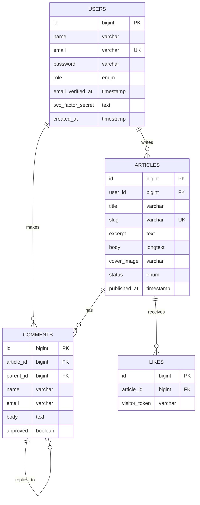

# Dokumentasi Teknis: Blog Mini PWA

## Penjelasan untuk Presentasi Akademik

---

## 1. Arsitektur Aplikasi

```
┌─────────────────────────────────────────────────────────────┐
│                      CLIENT (Browser)                        │
│  ┌─────────────┐  ┌─────────────┐  ┌─────────────────────┐  │
│  │   HTML/CSS  │  │  Alpine.js  │  │   Service Worker    │  │
│  │  (Blade)    │  │ (Interaksi) │  │   (PWA Caching)     │  │
│  └─────────────┘  └─────────────┘  └─────────────────────┘  │
└───────────────────────────┬─────────────────────────────────┘
                            │ HTTP Request
                            ▼
┌─────────────────────────────────────────────────────────────┐
│                      SERVER (Laravel 12)                     │
│  ┌─────────────┐  ┌─────────────┐  ┌─────────────────────┐  │
│  │  Controllers │  │   Livewire  │  │    Middleware       │  │
│  │  (API/Web)  │  │ (Komponen)  │  │   (Auth, CSRF)      │  │
│  └─────────────┘  └─────────────┘  └─────────────────────┘  │
│  ┌─────────────┐  ┌─────────────┐  ┌─────────────────────┐  │
│  │   Models    │  │   Policies  │  │     Fortify         │  │
│  │  (Eloquent) │  │ (Otorisasi) │  │  (Autentikasi)      │  │
│  └─────────────┘  └─────────────┘  └─────────────────────┘  │
└───────────────────────────┬─────────────────────────────────┘
                            │ Query
                            ▼
┌─────────────────────────────────────────────────────────────┐
│                     DATABASE (SQLite/MySQL)                  │
│        users, articles, comments, likes, sessions           │
└─────────────────────────────────────────────────────────────┘
```

---

## 2. Technology Stack

### Backend Framework
| Komponen | Teknologi | Versi | Keterangan |
|----------|-----------|-------|------------|
| Framework | **Laravel** | 12.x | PHP Framework untuk aplikasi web modern |
| Bahasa | **PHP** | ≥ 8.2 | Server-side scripting language |
| Server | **Apache/Nginx** | - | Web server (via Laragon) |

### Frontend Technologies
| Komponen | Teknologi | Keterangan |
|----------|-----------|------------|
| Template Engine | **Blade** | Laravel's template engine untuk views |
| CSS Framework | **Tailwind CSS** | Utility-first CSS framework |
| UI Components | **Flux UI** | Laravel UI component library |
| JavaScript | **Alpine.js** | Lightweight reactive JS framework |
| Reactivity | **Livewire** | Full-stack framework untuk SPA-like experience |

### Progressive Web App (PWA)
| File | Fungsi |
|------|--------|
| `manifest.json` | Metadata aplikasi (nama, ikon, tema) |
| `sw.js` | Service Worker untuk caching & offline |
| `offline.html` | Halaman fallback saat offline |

---

## 3. Database

### Database Management System
- **Development**: SQLite (file-based, ringan)
- **Production Ready**: MySQL/MariaDB

### Entity Relationship Diagram (ERD)



### Tabel Database

| Tabel | Deskripsi | Relasi |
|-------|-----------|--------|
| `users` | Data pengguna (admin/user) | Has Many: articles, comments |
| `articles` | Artikel blog | Belongs To: user, Has Many: comments, likes |
| `comments` | Komentar artikel | Belongs To: article, Self-referencing (nested) |
| `likes` | Like berbasis visitor token | Belongs To: article |
| `sessions` | Session management | - |

---

## 4. Sistem Autentikasi

### Framework Autentikasi
Aplikasi menggunakan **Laravel Fortify** sebagai backend autentikasi.

```
┌─────────────────────────────────────────────────┐
│            LARAVEL FORTIFY                       │
├─────────────────────────────────────────────────┤
│  ✓ Login / Logout                               │
│  ✓ Registrasi User                              │
│  ✓ Password Reset                               │
│  ✓ Email Verification                           │
│  ✓ Two-Factor Authentication (2FA)              │
│  ✓ Profile Management                           │
└─────────────────────────────────────────────────┘
```

### Fitur Keamanan

| Fitur | Implementasi |
|-------|--------------|
| **Password Hashing** | Bcrypt (default Laravel) |
| **CSRF Protection** | Token-based, auto-generated |
| **Session Management** | Database-backed sessions |
| **Two-Factor Auth** | TOTP (Time-based One-Time Password) |
| **Rate Limiting** | Throttle middleware |

### Role-Based Access Control

```php
// Roles: 'admin' | 'user' (default)

// Middleware untuk admin area
Route::middleware(['auth'])->prefix('admin')->group(function () {
    // Hanya user dengan role 'admin' yang bisa akses
});
```

---

## 5. Web Services & API

### Internal API Endpoints

| Method | Endpoint | Deskripsi | Auth |
|--------|----------|-----------|------|
| POST | `/chat` | AI Chatbot (OpenRouter) | Public |
| POST | `/articles/{slug}/like` | Like artikel | Public (session-based) |
| POST | `/articles/{slug}/comments` | Kirim komentar | Auth required |

### External API Integration

#### OpenRouter AI Chat
```
Provider: OpenRouter (https://openrouter.ai)
Model: DeepSeek R1 (deepseek/deepseek-r1-0528:free)
Fungsi: Chatbot asisten virtual untuk membantu pengunjung
```

---

## 6. Fitur Aplikasi

### Fitur Publik
- ✅ Homepage dengan daftar artikel
- ✅ Pencarian artikel
- ✅ Detail artikel dengan komentar
- ✅ Like artikel (berbasis session)
- ✅ AI Chatbot asisten

### Fitur Admin
- ✅ Dashboard statistik
- ✅ CRUD Artikel
- ✅ Moderasi komentar
- ✅ Manajemen user

### Fitur PWA
- ✅ Installable ke home screen
- ✅ Offline fallback page
- ✅ Caching static assets
- ✅ Native app-like experience

---

## 7. Development Tools

| Tool | Fungsi |
|------|--------|
| **Laragon** | Local development environment |
| **Composer** | PHP dependency manager |
| **NPM** | JavaScript package manager |
| **Vite** | Frontend build tool |
| **Artisan** | Laravel CLI tool |

---

## 8. Cara Menjalankan

```bash
# 1. Install dependencies
composer install
npm install

# 2. Setup environment
cp .env.example .env
php artisan key:generate

# 3. Database setup
php artisan migrate --seed
php artisan storage:link

# 4. Run application
npm run dev          # Terminal 1
php artisan serve    # Terminal 2

# 5. Akses di browser
# http://localhost:8000
# Login: admin@example.com / password
```

---

**Dibuat dengan Laravel 12 + Livewire + Tailwind CSS + Alpine.js**
